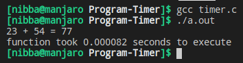

# Program Timing
This script checks the time required to run a function in C.

## To use
* Edit `void function` and write your own operations.
* Compile with `gcc timer.c -o timer`.
* Execute with `./timer`

## Output

