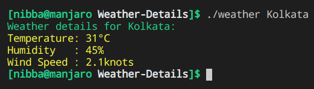

# Get Weather Details of a city
The following program uses cURL to perform an HTTP GET request to Open Weather API. The reponse(JSON) is then parsed with the help of json-c library to extract the necessary information. Makefile is responsible for automated compilation of the script. Terminal output is colored using ANSI codes for green and yellow.

## Dependencies
  * cURL
  * json-c

## Running script
  * Build by running: `make`
  * Save your API key in `key` file.
  * Execute by : `./weather <city-name>`
  * for e.g : `./weather Kolkata`

## Output

