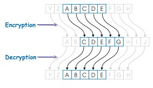

# Caesar Cipher- Cryptography with Python

## Overview:

Caesar Cipher is one of most easiest and simplest encryption methods. It is a stype of substitution cipher.
It works by shifting each character of the input string by a given value down the alphabetical order.

Example: Upon giving a shift key of 2, A would be replaced by C, B by D and so on.

	

