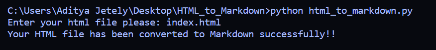
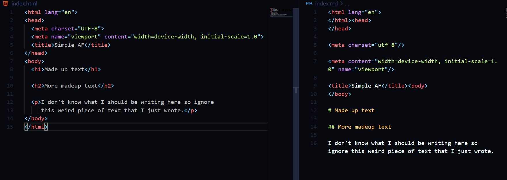

## HTML to Markdown converter 

This script converts HTML Files into Markdown.

## Requirements for this script:

1.html2markdown

install these two by running the following command:

pip install -r requirements.txt

## How to use this script?

Just type the following in your command prompt:

python html_to_markdown.py

## Sample of the script in action:

	

	

