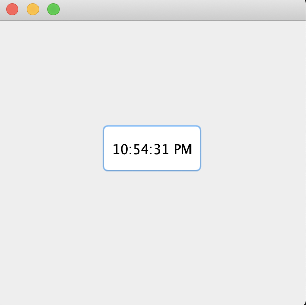

# Simple Digital Watch written in Java
The aim of this program is to display the current running time in digital format using Java swing and awt libraries. The output of this program open as new window which shows the current time and time-period(AM/PM).

## Libraries Used:
* [Java Swing](https://www.javatpoint.com/java-swing) - used to create window-based applications, built on the top of AWT API and entirely written in java.
* [Java AWT(Abstract Windowing Toolkit)](https://www.javatpoint.com/java-awt) - an API to develop GUI or window-based applications in java.
* [Java Text](http://web.deu.edu.tr/doc/oreily/java/fclass/ch16_js.htm) - used for Date format in this program.

## Usage:
`>> javac DigitalWatch.java`

`>> java DigitalWatch`

A window pops up showing the digital watch.

## Output:
