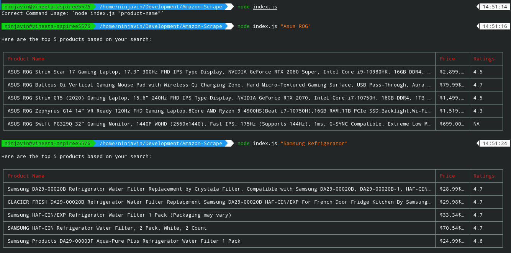

# Scrape Amazon Using NodeJS

This script scrapes Amazon for the product you searched and returns the top 5 results with their price and ratings

## How to Run?
+ Run `npm i` to install the dependencies.
+ Run `node index.js "<product-name>"` to search for a particular product.

## Example

