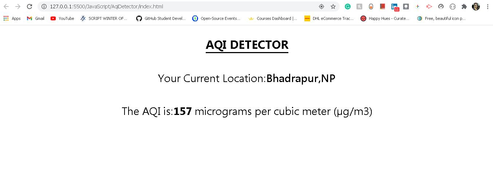

## AQI Detector:
- This script built in Javascript is a AQI Detector. 
- The script automatically detects the location of the current city or the nearest city.
- If the browser supports the geolocation feature, it didplays AQI and the location,else error message is displayed. 

- Output of the script. 