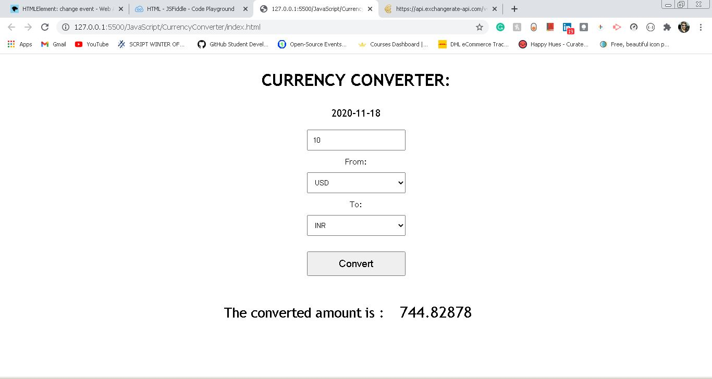

## Currency Converter
- This script built in Javascript is a Currency Converter. 
- The user enters :
    - The amount to convert.
    - The current currency.
    - The converting currency.

- Output of the script. 