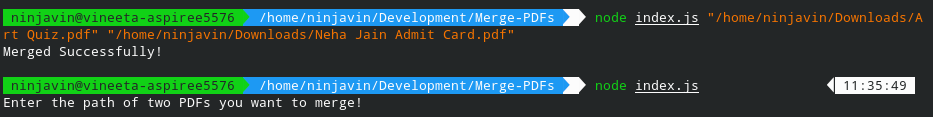

# Merge PDFs

This script written in NodeJS can merge two PDFs and generate a single PDF.

## How to Run?

[+] Run `npm i` to install all the dependencies
[+] Run `node index.js "<filepath1>" "<filepath2>"` to merge 2 pdfs and generate a single pdf

## Example

