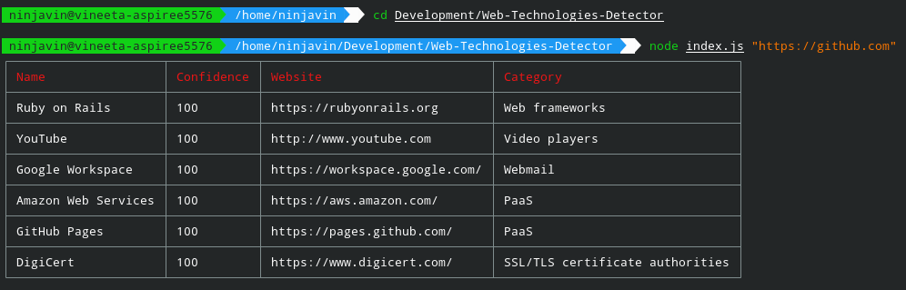

# Detect Web Technologies behind any Website

This script uses "Wappalyzer" and detects the technologies used to build a website.

## How to Run?

+ Run `npm i` to install all the dependencies.
+ Run `node index.js "<website-name>"` to search for the website whose technologies you would like to detect

## Example

