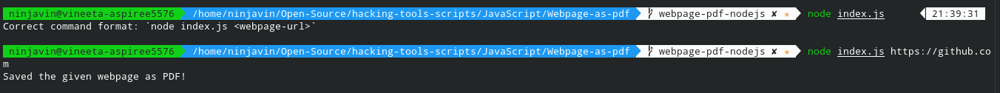

# Save a Webpage as a PDF

This NodeJs Script uses Puppeteer and saves a webpage as a pdf.

## How to Run?

+ Run `npm install` in the project folder.
+ Run `node index.js "<webpage-url>"` to save the webpage as PDF.

## Sample Input & Output

