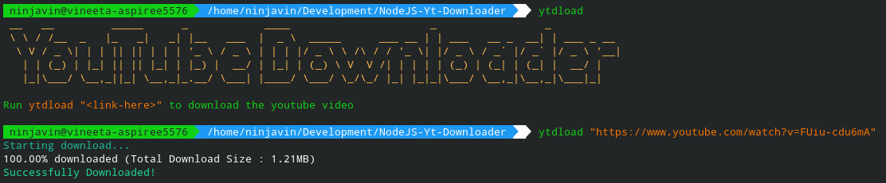

# A Simple YouTube Video Downloader in NodeJS

This NodeJs Script downloads the youtube video from the url mentioned.

## How to Run?

+ Run `npm install i` in the project folder.
+ Run `ytdload "<youtube-video-link>"` to download any YouTube video.
> You can also run `npm install -g .` in the project folder, this will allow you to run the script from any location.

## Sample Input & Output

