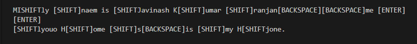
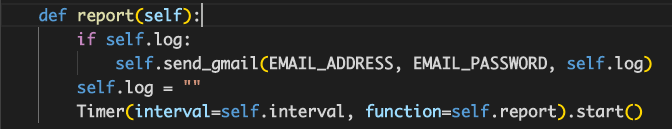

# Keylogger
Keyloggers are a type of monitoring software designed to record keystrokes made by a user. One of the oldest forms of cyber threat, these keystroke loggers record the information you type into a website or application and send to back to a third party.

## Script Functionalities:

* Keylogging
* Can Save the keylogs in a file (you can change the local of file to wherever you want)
* Can print the keylogs after given interval of time (in the case 20 mintues, if you want you can change the time interval)
* It will mail you all the keylogs after given interval of time.

## Keylogger Setup:
1. Create a virtual environment
2. Install the required packages using `pip3 install -r requirements.txt`
3. Run the Script and It will do the rest of the work.

## Keylogger Instructions:
 ### Step 1: 
    Open Termnial 💻
 ### Step 2: 
    Locate to the directory where python file is located 📂
 ### Step 3: 
    Run the command: python3 filename.py
 ### Step 4: 
    Sit back and Relax. Let the Script do the Job. ☕

    
### Samples
#### Keylogs in a file

#### Keylogs in the Terminal

#### Keylogs in the mail

### Q. How can you make this your script your own ?
 ### Step 1: 
      Add Your Email and Password to Script. Here ⬇

 ### Step 2: 
      Change the Location and name of the file as per your preference. Here ⬇

 ### Step 3: 
      Change the preference, if you want or if you don't want to print the key logs in the Terminal. Here ⬇

### Note:
If you want setup in the any other person computer it need to be run as a background process. So make sure to setup accordingly.

### Disclaimer:
This script is developed only for educational purposes only.