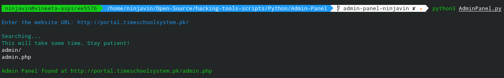

# Description

A Python Script to find admin panel of a website

## How to execute this Script

+ Run `pip install -r requirements.txt` to install the required packages.
+ Run the script using `python3 AdminPanel.py`

## Example

