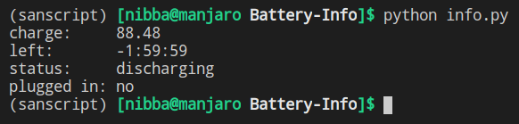

# Battery Information of a Device.
The following script provides necessary battery information.

## Running Script
  * Install dependencies `pip install -r requirements.txt`
  * Execute script `python info.py`

## Output

