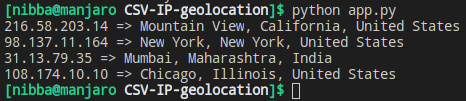

# Generate geolocation of IP addresses given in a CSV file.
* Extracts the IP addresses from a csv file named `IP_data.csv` where the column name is `IP`.
* Performs a GET request to an [API](https://ip-api.com/).
* Prints the results as `IP => city, state, country` for each IP address extracted.

## Executing script
* `python app.py`

## Output

