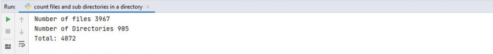

# To count number of files and sub directories in a directory

## How to Run?

* Create folder in your desktop and copy the path
* HOME_FOLDER = paste the path name
* Run 'Count_number_of_files.py'

## Output

