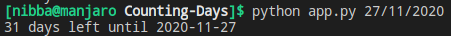

# Counting Days
Allows the user to count the number of days left until a specified target date.

## Executing script
* Run `python app.py <date in dd/mm/yyyy format>`
* for e.g `python app.py 27/11/2020`.

## Output
