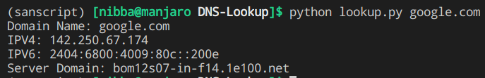

# DNS Lookup
The Domain Name System is a hierarchical and decentralized naming system for computers, services, or other resources connected to the Internet or a private network. It associates various information with domain names assigned to each of the participating entities.

## Executing the Script
  * Run: `python lookup.py <website or IP address>`
  * for e.g `python lookup.py google.com`
  * or `python lookup.py 142.250.67.174`

## Output

