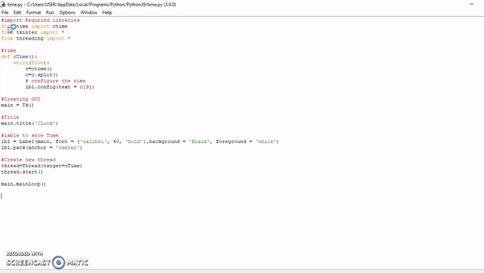

## GUI FOR DIGITAL WATCH
- This script is built in Python, for digital clock. 
- The time and tkinter Libraries are used to built this scripts.

## Requirements
- tkinter module
- time module

## Working

- The script runs and digital clock is appear by the GUI.