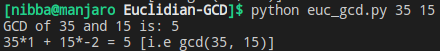

# Euclid's GCD Algorithm and relevance in cryptography.
GCD(Greatest common divisor) of two numbers is the largest number that divides both of them. A simple way to find GCD is to factorize both numbers and multiply common factors.

The **Euclid's GCD** algorithm is based on below facts:
* If we subtract smaller number from larger (we reduce larger number), GCD doesn’t change. So if we keep subtracting repeatedly the larger of two, we end up with GCD.
* Now instead of subtraction, if we divide smaller number, the algorithm stops when we find remainder 0.
* The algorithm also updates results of gcd(a, b) using the results calculated by recursive call gcd(b%a, a).

## Relevance in Cryptography

The extended Euclidean algorithm is particularly useful when a and b are coprime (or gcd is 1). Since x is the modular multiplicative inverse of “a modulo b”, and y is the modular multiplicative inverse of “b modulo a”. In particular, the computation of the modular multiplicative inverse is an essential step in RSA public-key encryption method.

## Executing script
* Run `python euc_gcd.py <number1> <number2>`
* for e.g `python euc_gcd.py 35 15`

## Output

