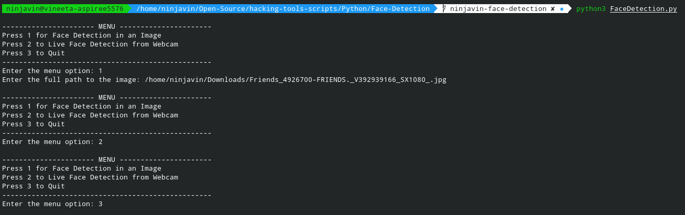
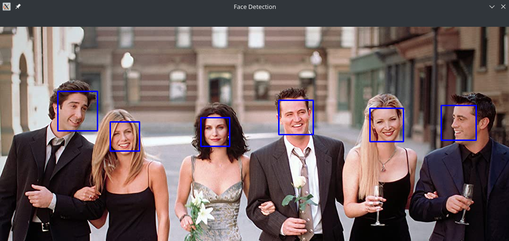

# Description

A Python Script to detect faces in a live video from webcam or from images.

## How to execute this Script

+ Run `pip install -r requirements.txt` to install the required packages.
+ Run the script using `python3 FaceDetection.py`
+ To quit the script, press `q` key on your keyboard

## Input

## Output

