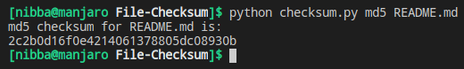

# Generating Checksums for a File

A checksum is a small-sized datum derived from a block of digital data for the purpose of detecting errors that may have been introduced during its transmission or storage. By themselves, checksums are often used to verify data integrity but are not relied upon to verify data authenticity.

The procedure which generates this checksum is called a checksum function or checksum algorithm. Depending on its design goals, a good checksum algorithm will usually output a significantly different value, even for small changes made to the input. This is especially true of cryptographic hash functions, which may be used to detect many data corruption errors and verify overall data integrity; if the computed checksum for the current data input matches the stored value of a previously computed checksum, there is a very high probability the data has not been accidentally altered or corrupted.

## Executing the Script
* Run `python checksum.py <algorithm> <file_path>`
* for e.g `python checksum.py md5 README.md`

## Output

