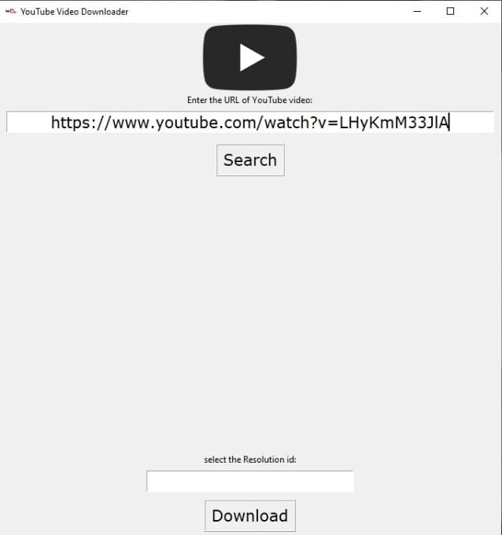
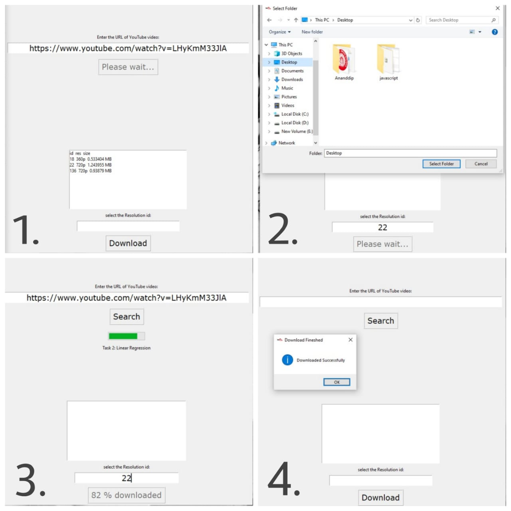

## GUI YouTube Video Downloader 
- This script built in Python is an YouTube Video Downloader. 
- The pytube, threading and tkinter libraries are used to built the app.
## Working
 
- The user interface(image is displayed above) is displayed as soon as the script execute.

- The user enters :
    - The URL of the video which he would like to download.
    - press the search button.
    - He/She selects video resolution.
    - press the download button.
    - He/She select the storage PATH.
- The script runs and the progess is reflected in the progress bar.
- a Pop-up massage is displayed which shows video is downloaded succsessfully
