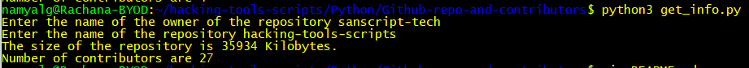

# Contributors and Size of a Github Repository
- This script can be used to obtain the size of a repository in Kilobytes and the number of contributors
- The API endpoint used is https://api.github.com/repos/

### Requirements
- pip install requests

### Working
- The user is prompted to enter :
    - The username of the owner of the repository
    - The name of the repository
- Considering an example of the repository : https://github.com/sanscript-tech/hacking-tools-scripts , the username is sanscript-tech, the name of the repository is hacking-tools-scripts

