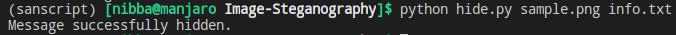
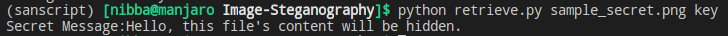

# Image Steganography
Steganography is the art and science of embedding secret messages in a cover message or file in such a way that no one, apart from the sender and the intended recipient, suspects the existence of the message. In case of Image Steganography, secret messages are embedded in images.


One of the algorithms to do so is known as **Least Significant Bit Insertion**. In this script the following operations are done:

**While Hiding:**
1. Image and message is read from a text file.
2. The message is encrypted with a key.
3. The encrypted message is then embedded with the image.

**While Retrieving:**
1. Encrypted message is extracted from the image.
2. Exncrypted message is then decrypted using the previous key.

## Executing the script:
* First install dependencies using: `pip install -r requirements.txt`
* To hide run: `python hide.py <image_path> <message_file_path>`
* for e.g: `python hide.py sample.png info.txt`
* To retrieve run: `python retrieve.py <image_path> <key_path>`
* for e.g: `python retrieve.py sample_secret.png key`

> Note: Avoid using JPEG or JPG files as they ruin the integrity of the message due to compression.


## Output:

**sample.png:**


**info.txt:**

```txt
Hello, this file's content will be hidden.
```

**Hiding:**




**sample_secret.png**


The image with the hidden message.


**key:**

`hrnyzqoF3aOwaOO4n9vnunH9KUD-nh-Ee5fjQcuLU9k=`

**Retrieving:**



Thank You!