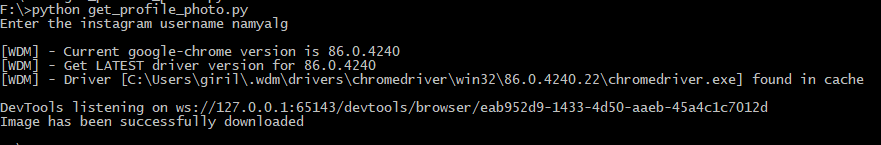

# Instagram-profile-picture-downloader

- This script can be used to download the Instagram profile picture of a given username

#### Requirements
- pip install selenium
- pip install webdriver
- pip install requests

#### Working
- The user is prompted to the desired username
- On entering the username, Selenium opens up and the url of the profile picture is obtained
- The image is downloaded with the name imstagram_profile.jpg

