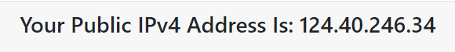
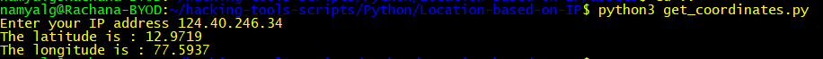
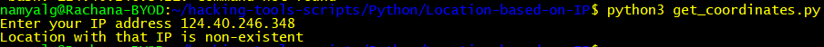

## Geo-location based on IP address
- This script can be used to obtain the latitude and longitude from where a particular IP address originates
- The API from https://ip-api.com/ has been used for the same

## Usage
- Requirements 
    - Requests module
    - JSON module
- Considering a example 

- The latitude and longitude will be obtained on running the script
- The user is prompted to enter the IP address

- If a location corresponding to an IP address is non-existent a suitable callback message is displayed

