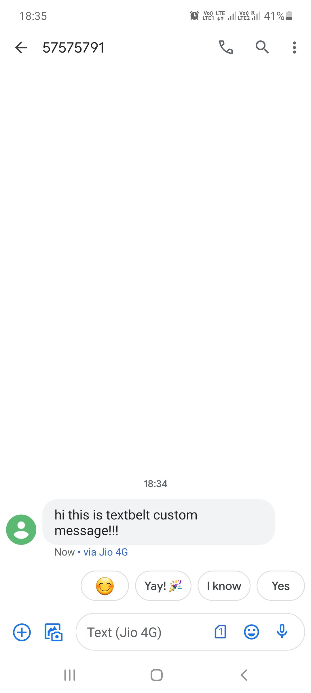

## Send Text Message via TextBelt
### Description
The aim is to anonymously send a text message to a mobile number programmatically.

### Library used
* [requests](https://2.python-requests.org/en/v2.7.0/)

### About TextBelt API:
*Textbelt* is an SMS API that is built for developers who just want to send and receive SMS.  Sending an SMS is a simple thing.  The API is correspondingly simple, without requiring account configuration, logins, or extra recurring billing.

The `https://textbelt.com/text` endpoint accepts a POST request with the following parameters:

* `phone`: A phone number.  If you're in the U.S. or Canada, you can just send a normal 10-digit phone number with area code.  Outside the U.S., it is best to send the phone number in E.164 format with your country code. 
* `message`: The content of your SMS.
* `key`: Your API key (use textbelt to send a free message).

Every programming language has a way to send an HTTP POST request.  Instead of installing a special Textbelt library, just send a POST request.

*Response*

The /text endpoint will respond with JSON:
* `success`: Whether the message was successfully sent (true/false).
* `quotaRemaining`: The amount of credit remaining on your key.
* `textId`: The ID of the sent message, used for looking up its status.  Only present when success=true.  Use this to check SMS delivery status.
* `error`: A string describing the problem.  Only present when success=false.

### Parameters used and their Significance:
* phoneNumber : The 10 digit phone number given by the user.
* message : The message which the user wants to sent to the given phoneNumber.

### Pre-requisites:
Install requests library via pip/pip3

`>> pip3 install requests`

### Usage:
`>> python send_message.py`

### I/O:

```
Enter your 10 digit phone number: $(phone_number)

Enter your message: $(message)

Message successfully sent! 
```


</br></br>



**OR (if sending failed)**

```
Sorry...Message cannot be sent
Only one test text message is allowed per day.
```
