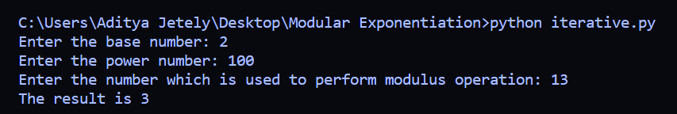
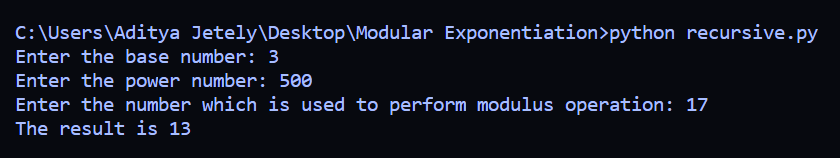

## Modular Exponentiation

Modular exponentiation is a very important topic in Discrete Mathematics as well as in Cryptography.
It's main application is in public-key cryptography.
It is an effective way of calculating modulus values of extremely large exponents values like 2^500 with ease.
You can refer to this amazing video to understand Modular exponentiation better:-
[Modular Exponentiation](https://www.youtube.com/watch?v=EHUgNLN8F1Y)

I have used two different approaches to solve this problem:

1. iterative
2. recursive

The time complexity in case of iterative approach is O(log(power)) which is awesome.

The time complexity in case of recursive approach is O(power) which is very nice as well.

## How to use these two programs?

1. For iterative approach type:

python iterative.py

Here is a sample use case:

	

2. For recursive approach type:

python recursive.py

Here is a sample use case:

	

