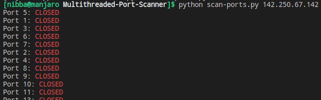
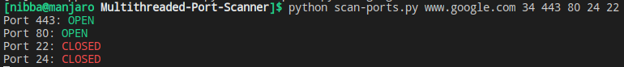

# Multithreaded Port Scanner
This script scans for open ports using multiple threads in parallel in which each port is checked on a separate thread. It is faster than the usual single threaded application.

## Executing the script
* Run `python scan-ports.py <IP or website name>`
* for e.g the following are valid calls:
    * `python scan-ports.py 142.250.67.142`
    * `python scan-ports.py www.google.com`

## Output

