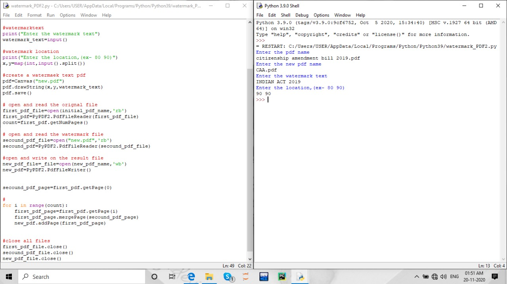

## PDF Watermark script
- This script built in Python is used to add PDF WATERMARK . 
- The user enters :
    - The Original PDF Name and the same PDF should be in current location.
    - Output PDF to be name.
    - Watermark Text.
    - Watermark coordinates.

- After the execution of the script new pdf with watermark is automatically created.
- You can use the <a href="http://www.africau.edu/images/default/sample.pdf"> sample pdf</a> for testing.
## Requirements
  - reportlab
  - pyPDF2

