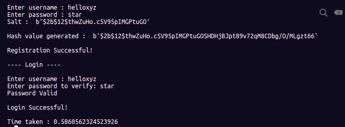
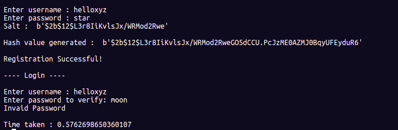

<h1 align="center">🔑 BCrypt Algorithm - Secured Cryptographic Password Hashing Module </h1>

## * What are Hash functions:

* [x] Hash functions are extremely useful and appear in almost all information security applications.🛡️
* [x] A hash function is a mathematical function that converts a numerical input value into another compressed numerical value.
     The input to the hash function is of arbitrary length but output is always of fixed length. 
     Values returned by a hash function are called message digest or simply hash values. 

## * Below image explains what is hashing  :

## * Applications of Hashing:

* [x] Message Digest.
* [x] Password Verification 🔠✅
* [x] Data Structures(Programming Languages).
* [x] Compiler Operation.
* [x] Rabin-Karp Algorithm.
* [x] Linking file name and path together.

## * Bcrypt Module:

* The bcrypt is a password hashing function designed by Niels Provos and David Mazières, based on the Blowfish cipher. 
* The bcrypt function is the default password hash algorithm for OpenBSD. 
* There are implementations of bcrypt for C, C++, C#, Java, JavaScript, PHP, Python and other languages. 
* The bcrypt algorithm creates hash and salt the password for us using strong cryptography. The computation cost of the algorithm is parameterized, so it can be increased as computers get faster. The computation cost is called work factor or cost factor. It slows down the hashing, making brute force attempts harder and slower.

## * Aim of this repo :
* [x] To demonstate working of bcrypt hash algorithm , which generates salt and hash value and compares it with password entered to check whether it is valid or invalid.

## * Scenario :
* [x] User enters username , password at time of registration , upon which hashed password is created by hashpw() function. Upon login , the entered password is checked against the hashed password and if matched , login is successful else not.

## * Note  :
* Note 1 : Each time a unique hash value , salt is generated.
* Note 2 : This is one such scenario implemented using bcrypt module for understanding of hash functions.Many other applications / variations can be implemented. 

## * Output  :

## * References and further notes   :
1. http://zetcode.com/python/bcrypt/
2. https://medium.com/swlh/hashing-technique-and-its-importance-e5a8c9a6e07a
3. https://auth0.com/blog/hashing-in-action-understanding-bcrypt/
