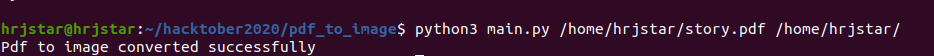
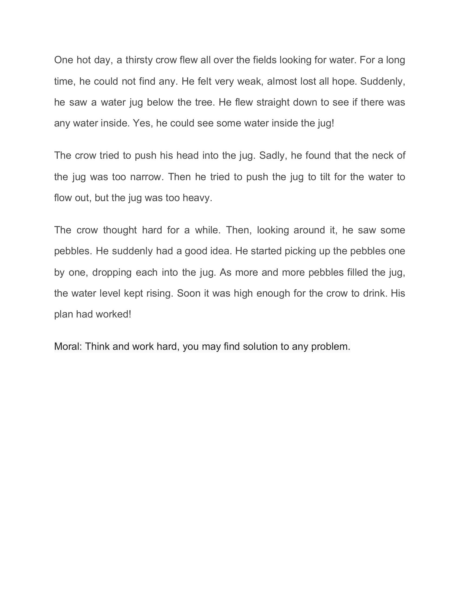

## PDF to Image using Python 

* This is a beginner-friendly script for converting pdf file to an image file (.jpg , .JPEG).

## To run the script
* Install pdf2image wrapper library using :

      pip3 install pdf2image

* Run the script as :
      
      python3 main.py (path of pdf file) (path to generate output image file)

* Example :

* Demo :

* Yay 😀 , your pdf file is now converted to an image file 🙌 ! 

