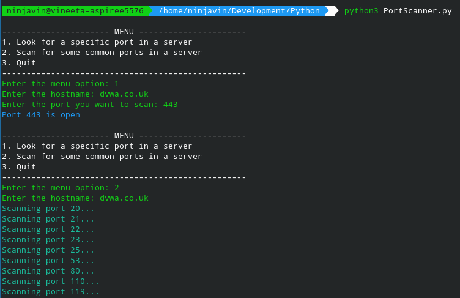
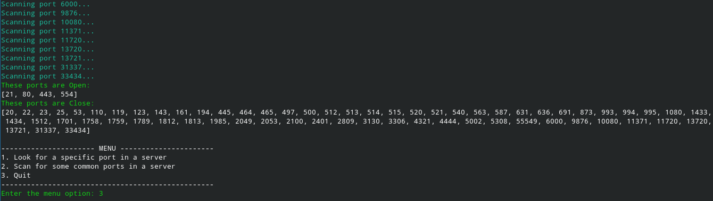

# Port Scanner

## How to Run?

* Download this folder in your system.
* `cd` into the folder.
* Install dependencies by running `pip install -r requirements.txt`
* Run `python3 PortScanner.py`

## Output

