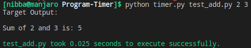
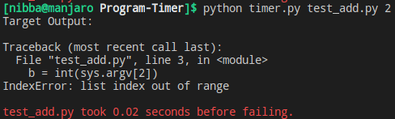

# Program Timer
Calculates the time taken by a python script to execute successfully or unsuccessfully. This can also be used to determine the time taken to execute any shell command or an executable.

## Executing the script
* Run `python timer.py <script> <necessary-arguments*>`
* For e.g `python timer.py test_add.py 2 3` will execute the `test_add.py` script with `2` and `3` as its commandline arguments. Any number of commandline arguments can be passed.

## Output

**Successful Execution**

**Failed Execution**

