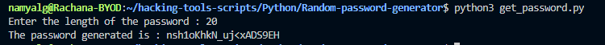

## Random password generator
- This script can be used to generate a password comprising of :
    - digits(0-9)
    - The English alphabet(a-z and A-Z) 
    - Special characters such as _$#%&*+<>!

## Usage
- The requirements are :
    - string module
    - random module
- The user is prompted to enter the length of the password that needs to be generated
- The randomly generated password is displayed as a result

## Working
- Considering an example where a password of length 20 characters has to be generated 

