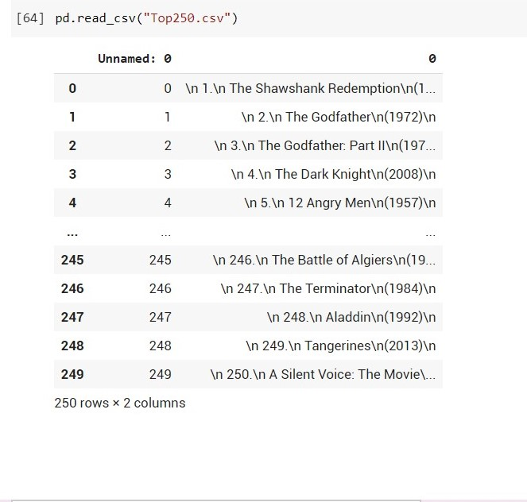

# Python Program to Scrap top 250 movies from IMDB's website.

This script scraps top 250 movies from IMDB website and generates a csv file for it.
Libraries Used:

- BeautifulSoup #Python package for parsing HTML and XML documents.
- Requests #library for requesting url/ making HTTP requests
- Pandas #library for Data Manipulation

### Output:

 
