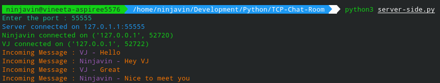
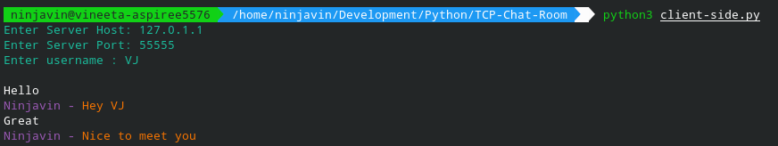
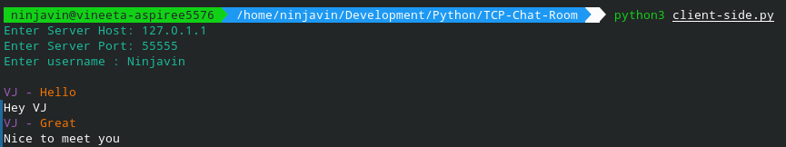

# TCP Chat Room

This Python Script creates a Chat Room through which you can chat using CLI.

## How to Run?

+ Run `python3 server-side.py` to run the server
+ Run `python3 client-side.py` to run the client thereafter

## Screenshots

