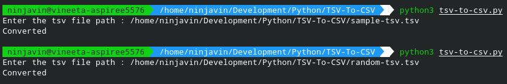
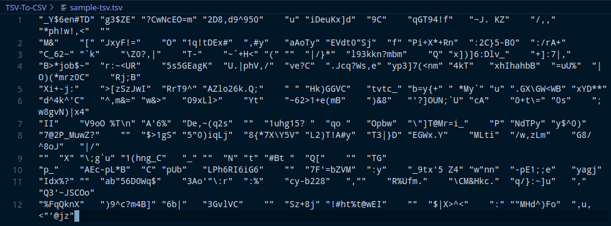
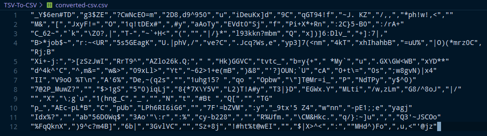

# Convert TSV to CSV File

This Python script takes in a tsv file location as input and gives its equivalent csv file.

## How to Run?

Run `python3 tsv-to-csv.py` to execute the script.

## Screenshots

