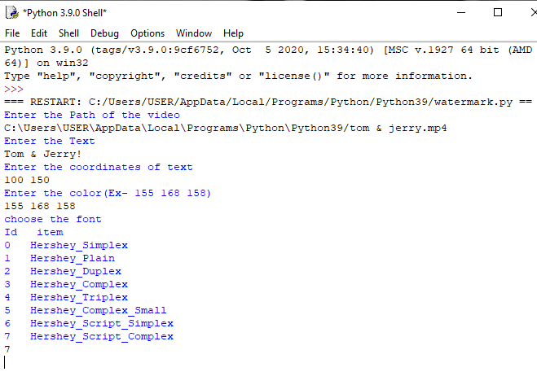
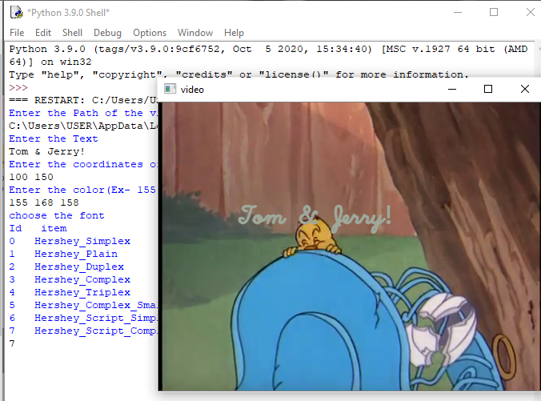

## watermark a video with a given font
- This script built in Python, using this python script you can watermark a video. 
- The OpenCV and Numpy Libraries are used to built this scripts.
## Working

- The user enters :
    - write the Path of the video with proper video extension and press Enter.
    - enter the text that you want to mark on the video, press Enter.
    - give two space seprated coordinate value(location where you want to mark the text).
    - give 3 space seprated value for text colour(RGB, Ex- 155 168 158) press Enter.
    - Select the font-type from the given list.
- The script runs and the text is mark on the video.
