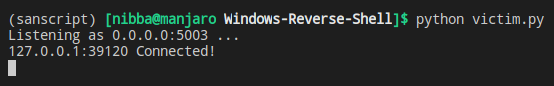
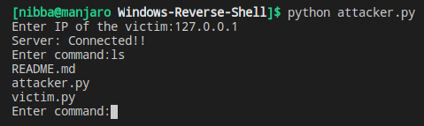

# Windows Reverse Shell
A reverse shell is a type of shell in which the target machine communicates back to the attacking machine. The attacking machine has a listener port on which it receives the connection, which by using, code or command execution is achieved. In other words, an attacker can execute various shell commands on the victim computer and can get the output back remotely.

## Executing Script
* Run `python victim.py` on the victim device.
* Run `python attacker.py` on the attacker device.
* When prompted enter the local IP of your victim. If you are testing both the scripts on the same device then provide the following IP:`127.0.0.1`(localhost).
* Once connected you can execute shell commands on the victim system by writing them on the attacker system.

## Output

**Victim**

**Attacker**

