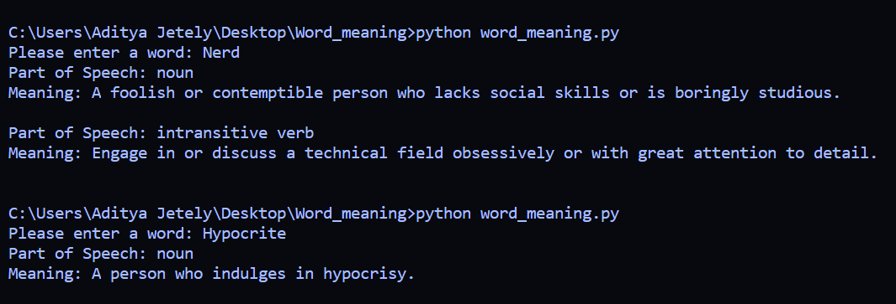

## Word Meaning 

This script fetches the meaning of a word with the help of an API.
The API used in this script is [dictionaryapi](https://dictionaryapi.dev/)
There is no need of an API Key or token to use this script.

## Requirements for this script:

1.requests

install this by running the following command:

pip install -r requirements.txt

## How to use this script?

Just type the following in your command prompt:

python word_meaning.py

## Sample of the script in action:

	

