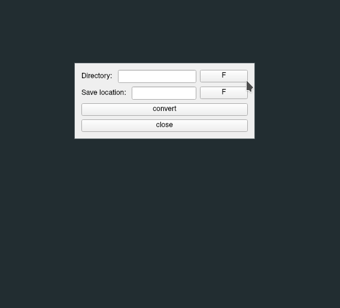

# Converts Folder to a Zip

## GUI Version

<p align="center">
  </img>
</p>


## CMD Version

### USAGE

```python
convert.py -h
```

or 


```python
convert.py --help
```


```python
convert.py <location_of_dir> <place_to_be_saved>
```


**TO RUN THE GUI VERSION CHECK THE REQUIREMENT TXT**
