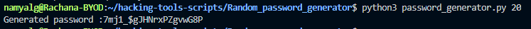

## Random Password Generator
- This script can be used to generate a strong randomly password
- The length of the password is passed as a Command Line argument

## Working
- Considering a case, where the password needs to be 20 characters long, the following can be executed

