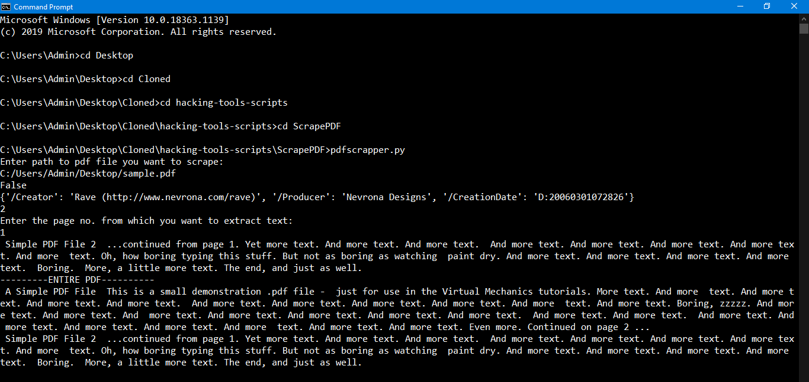

# Script to scrape pdf

## Overview:
- A beginner friendly script to scrape pdf. You can easily get document info sunch as creator , creation_date and no. of pages. Extract as many pages as you want.

### Installing required libraries

`` pip install PyPDF2 ``

## How to use this script?

- Direct to the ScapePDF folder in Command prompt and type the following command:  

`` python pdfscrapper.py ``

- After this you have to enter the path of the pdf file.
- Ex: C:/Users/Admin/Desktop/sample.pdf
- You will recieve information  about the pdf like who created it and when it was created 
- After that you will recieve scrapped text from pdf

### Example Output

	

