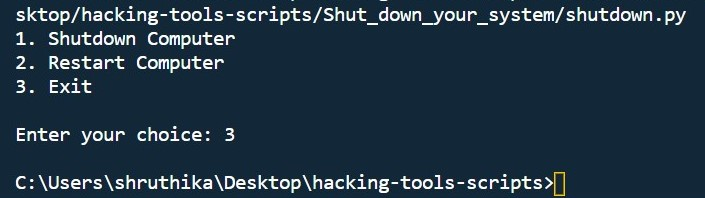
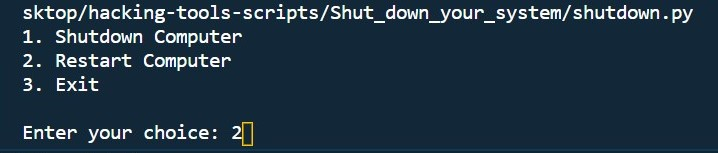
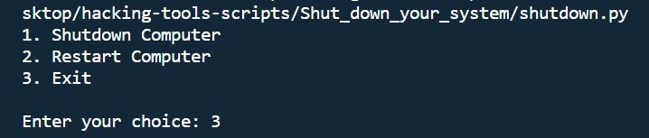
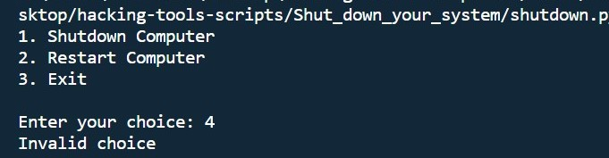

# Python Program to shutdown/restart your system

This scripts gets user choice as input, and performs action according to the choice inputted. The choices are Shutdown, Restart and Exit.
The python command for shutting down and restart are as follows, "shutdown /s /t 1" and "shutdown /r /t 1", and works in the os.system() function of os library.

## Warning: This might shutdown your system as soon as executed, hence make sure you save and close all other files and windows.

### Output:
 ### Shutdown:
 
   
 
 ### Restart:
 
 
 
 ### Exit:
 
 
 ### Invalid Choice:
 
 
  
